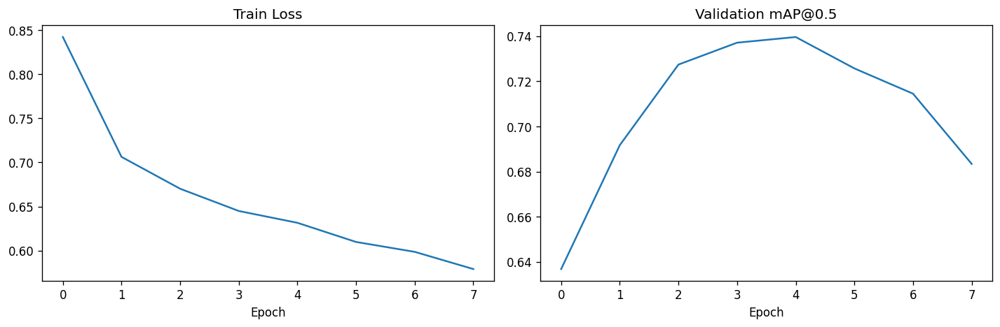
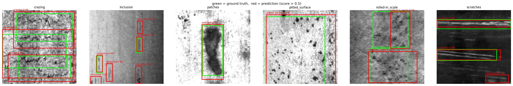
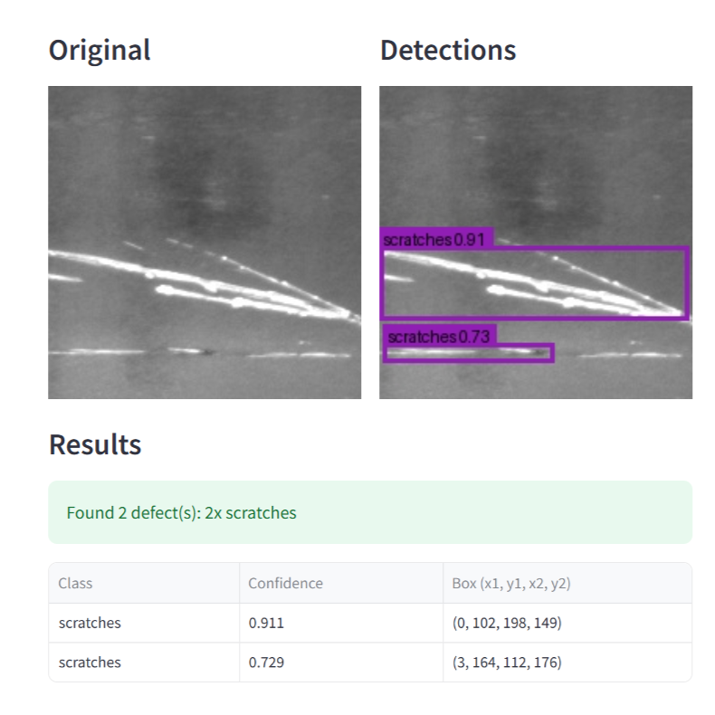

# Industrial Defect Detection

End-to-end computer vision pipeline for classifying **and localizing**
surface defects on steel, using classical image processing (OpenCV) and
deep learning (PyTorch), with an interactive Streamlit demo.

## Why this project

This repository extends image-analysis skills directly relevant to my
M.Sc. thesis at FAU Erlangen-Nürnberg (Institute of Photonic Technologies),
*"Development of a Dynamic 3D Model of the Keyhole"*, where I reconstruct
the 3D geometry of the vapor capillary (keyhole) during laser beam welding
from synchrotron X-ray images. Both projects share the same core toolkit:

| Thesis (X-ray keyhole reconstruction) | This project (defect detection) |
|---|---|
| Contour extraction from X-ray projections | Contour / boundary extraction from surface images |
| Automated feature extraction (depth, width, fluctuations) | Automated defect localization and classification |
| Python + image processing pipeline | Python + OpenCV + PyTorch pipeline |
| Distinguishing pores/cracks from background | Distinguishing defect types from clean surface |

This project is a portfolio piece for Data Scientist / ML Engineer roles
in Germany's industrial sector (e.g. automotive, manufacturing, process
quality control).

## Dataset

**NEU Surface Defect Database** — steel-strip surface images across 6
defect classes: crazing, inclusion, patches, pitted surface, rolled-in
scale, scratches. Ships with Pascal-VOC-style XML bounding-box
annotations, used in Phase 3. Not committed to this repo — see
`docs/dataset.md` for download instructions and the expected layout.

## Project structure

```
industrial-defect-detection/
├── data/
│   ├── raw/            # original NEU-DET images + annotations (not tracked)
│   └── processed/      # preprocessed/augmented images (not tracked)
├── notebooks/
│   ├── 01_eda.ipynb                           # exploratory data analysis
│   ├── 02_baseline_model.ipynb                # baseline CNN training
│   ├── 03_transfer_learning_comparison.ipynb  # ResNet18 fine-tuning
│   ├── 04_data_leakage_check.ipynb            # train/val duplicate analysis
│   └── 05_detection_model.ipynb               # Faster R-CNN detection
├── src/
│   ├── data/            # dataset loaders, XML annotation parser
│   ├── models/          # architectures, training loops, mAP metric
│   └── utils/           # OpenCV preprocessing, leakage-detection helpers
├── streamlit_app/
│   └── app.py           # interactive defect-detection demo
├── tests/                # unit tests
├── docs/                 # dataset notes, model card, results
├── models/               # saved model weights (not tracked)
├── requirements.txt      # CPU / general setup
├── requirements-gpu.txt  # pinned CUDA setup (see notes in the file)
└── README.md
```

## Results

### Phase 2 — Classification (which defect type is in this image?)

| Model | Val Accuracy | Val Loss | Weighted F1 |
|---|---|---|---|
| Baseline CNN (from scratch) | 90.3% | 0.262 | 0.90 |
| ResNet18 (fine-tuned, ImageNet-pretrained) | 100%* | 0.008 | 1.00* |

\* Inflated by train/validation leakage — see **Known Data Limitations**.

The baseline CNN was trained from scratch (3 conv blocks + 2 FC layers,
15 epochs, Adam, lr=1e-3). ResNet18 was fine-tuned end-to-end from
ImageNet-pretrained weights (10 epochs, Adam, lr=1e-4). Both use the same
reusable training loop (`src/models/train.py`), so the comparison isolates
the effect of architecture/pretraining, not the training procedure.

### Phase 3 — Detection (where is each defect?)

Faster R-CNN with a COCO-pretrained MobileNetV3-Large FPN backbone,
fine-tuned for 8 epochs (SGD, lr=5e-3, batch size 2). Evaluated with a
custom, dependency-free mAP implementation (`src/models/detection_metrics.py`).

**Best validation mAP@0.5: 0.740** (epoch 5)

| Class | AP@0.5 |
|---|---|
| scratches | 0.881 |
| pitted_surface | 0.834 |
| patches | 0.832 |
| inclusion | 0.757 |
| rolled-in_scale | 0.618 |
| crazing | 0.517 |





Two findings worth noting:

**Overfitting after epoch 5.** Training loss kept falling through epoch 8
(0.84 → 0.58) while validation mAP peaked at epoch 5 and then declined to
0.68 — the model began memorizing training specifics rather than learning
generalizable features. Best-checkpoint-by-mAP saving means the exported
model is the epoch-5 one, not the final epoch. For this dataset size, ~5
epochs is the right budget.

**Per-class AP tracks defect geometry, not model quality alone.** The two
weakest classes, `crazing` (0.52) and `rolled-in_scale` (0.62), are both
diffuse, texture-like defects spanning most of the image surface. Their
ground-truth annotations consist of several large overlapping boxes with
no clear boundaries — when human annotators can't draw a crisp box, a high
IoU-thresholded AP isn't an achievable target. The localized, well-bounded
defects (`scratches`, `pitted_surface`, `patches`) score 0.83–0.88.

Unlike the Phase 2 classification figure, this mAP is not inflated by the
dataset's near-duplicate leakage: localization is a substantially harder
task, and 0.74 is a realistic, defensible number for this setup.

## Interactive Demo

```bash
streamlit run streamlit_app/app.py
```

Upload a steel-surface image and the fine-tuned detector returns bounding
boxes with class labels and confidence scores. A sidebar slider controls
the confidence threshold, so the precision/recall trade-off can be
explored interactively. The trained weights are committed to `models/`,
so the demo runs immediately after cloning — no training required.



## Known Data Limitations

Investigation via perceptual hashing (`notebooks/04_data_leakage_check.ipynb`,
`src/utils/leakage_check.py`) found that **50 of 360 validation images
(~14%)** are near-duplicates (Hamming distance ≤ 5) of a training image —
a known characteristic of this NEU-DET distribution, where many crops
originate from a small number of source micrographs.

Leakage is heavily concentrated in two classes:

| Class | Near-duplicates | Share of val set |
|---|---|---|
| inclusion | 26/60 | 43% |
| pitted_surface | 16/60 | 27% |
| crazing | 6/60 | 10% |
| scratches | 2/60 | 3% |
| patches | 0/60 | 0% |
| rolled-in_scale | 0/60 | 0% |

This largely explains the 100% ResNet18 classification accuracy — the
model effectively saw near-identical images during training for the two
highest-leakage classes. Notably, `patches` and `rolled-in_scale` had
**zero** detected duplicates and still scored a perfect F1, suggesting
those two defect types are genuinely highly separable. The 100% figure
should be read as an artifact of the dataset split, not a claim of
real-world accuracy — a caveat any production use of this dataset should
account for (e.g. by re-splitting at the source-micrograph level rather
than per-crop).

## Roadmap

- [x] Phase 1 — Project scaffolding, EDA, OpenCV preprocessing pipeline
- [x] Phase 2 — Baseline CNN classifier + ResNet18 transfer-learning comparison
- [x] Phase 2b — Data-quality audit (train/val leakage check)
- [x] Phase 3 — Faster R-CNN detection on XML bounding-box annotations
- [x] Phase 4 — Streamlit demo wired up to the trained detection model
- [ ] Phase 5 — Polish: tests, CI, final documentation

## Setup

```bash
python -m venv venv
source venv/bin/activate  # Windows: venv\Scripts\activate
pip install -r requirements.txt
```

For CUDA training, install PyTorch from the PyTorch index first, then use
`requirements-gpu.txt` — see the notes at the top of that file for why the
versions are pinned.

## Status

Phases 1–4 complete: classification and detection models trained and
evaluated, with a documented data-quality caveat, plus a working
interactive demo. Phase 5 (tests, CI, final polish) remaining.

## Author

Mohammadreza Fallah — Data Scientist / ML Engineer, M.Sc. Computational
Engineering (FAU Erlangen-Nürnberg)
[LinkedIn](https://linkedin.com/in/mohammadrezafallah) ·
[GitHub](https://github.com/Mohammadreza-Fallah)
